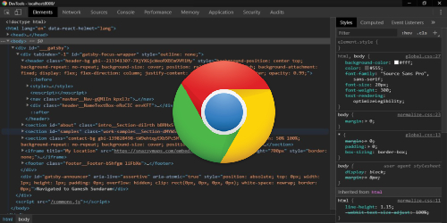
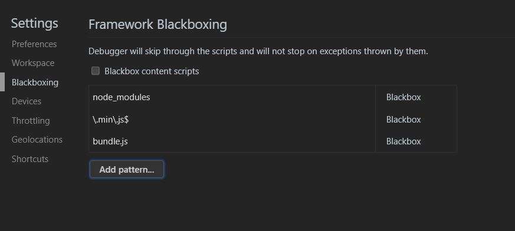
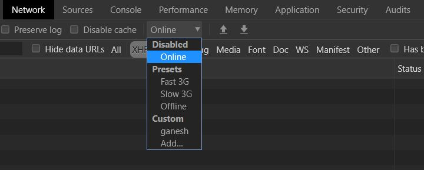
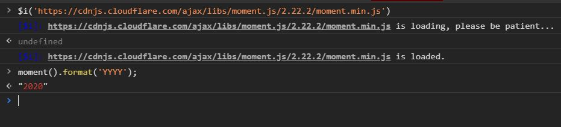

 

#### What is Chrome Devtools🤔

Chrome Devtools is a set of tools that helps you debug, inspect, and get other insights inside your website. It helps you see your website in slow motion and solve problems.

 

**Here goes my top 5 features that I like💁🏻‍♂️**

 

 

#### 1. Port Forwarding

Helps in running your site from your development machine's web server in a mobile device.

 

You can inspect and debug your site as you do in desktop chrome. Your changes are reflected on mobile when you hit save as it happens on desktop.

 

You will need usb cable and chrome app installed in your smartphone with usb debugging enabled.

 

**Follow this [instructions](https://stackoverflow.com/a/57524521/5993663), if your using samsung phone and pc with windows!**

 

<iframe width="560" height="315" src="https://www.youtube.com/embed/AD6ZqyUtUaU" frameborder="0" allow="accelerometer; autoplay; encrypted-media; gyroscope; picture-in-picture" allowfullscreen></iframe>

 
 

#### 2. Blackboxing

When we use libraries like React lot of time while debugging we jump into source code of React. To avoid this we blackbox this scripts.

 

When you blackbox a source file, the debugger will not jump into that file when stepping through code you’re debugging. To blackbox any file you can simply go to sources tab in devtools and find your js file and then press right-key and select Black-box script.

 

But what you want to blackbox files inside node_modules? The solution for me is to make a pattern of files which must be blackboxed.

 

**Just hit the F1 to open Settings and chose the "Blackboxing" tab:**

 

 
 

#### 3. Shortcuts like VSCODE

Some of vscode shortcuts like CTRL+P for file search, CTRL+G for go to line number, CTRL+SHIFT+G for command palette, etc also works in devtools. You can use them to increase your productivity.

 
 

#### 4: Network Throttling

Lot of time we want to see how our website loads in slow networks. We can control internet speed using network throttling. We can use presets or create custom speed for throttling.

 

 

#### 5. Console Tab

You can use console tab as a playground for evaluating expressions, use packages like moment.js. Yes you read it right, there is a chrome extension [Console Importer](https://chrome.google.com/webstore/detail/console-importer/hgajpakhafplebkdljleajgbpdmplhie?hl=en) using which you can play with this packages.

 

 

 

You are amazing! ✨
